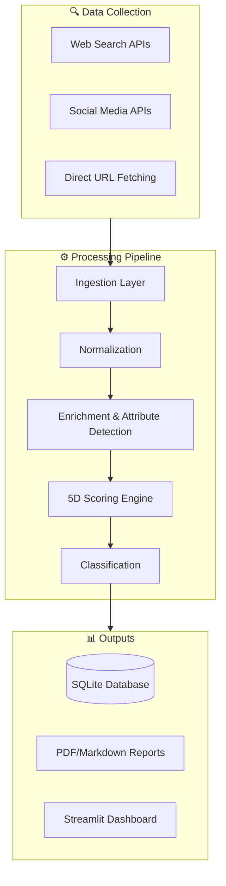
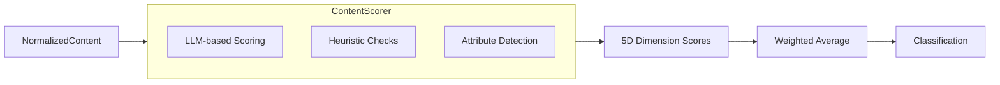

# Trust Stack Rating Tool — Architecture Overview

> **Purpose**: This document provides a comprehensive overview of the codebase architecture for new developers joining the project.

---

## 🎯 System Overview

The **Trust Stack Rating Tool** is a content quality assessment system that analyzes brand-linked content across digital channels using a **5D Trust Framework**. It collects content from multiple sources, scores it across five trust dimensions, and generates actionable reports.



---

## 📁 Directory Structure

```
authenticity-ratio/
├── config/                 # Configuration and settings
│   ├── settings.py         # Global settings, API configs, scoring weights
│   ├── rubric.json         # 5D scoring rubric with signals and thresholds
│   └── brand_guidelines/   # Brand-specific guideline files
│
├── core/                   # Core orchestration
│   └── run_manager.py      # Pipeline run management and orchestration
│
├── data/                   # Data layer
│   └── models.py           # SQLAlchemy ORM models + legacy dataclasses
│
├── ingestion/              # Data collection layer
│   ├── brave_search.py     # Brave Search API integration
│   ├── serper_search.py    # Serper (Google) Search API
│   ├── reddit_crawler.py   # Reddit API integration
│   ├── youtube_scraper.py  # YouTube Data API v3
│   ├── page_fetcher.py     # HTTP/Playwright page fetching
│   ├── normalizer.py       # Content standardization
│   ├── metadata_extractor.py   # Metadata extraction
│   ├── domain_classifier.py    # Brand-owned vs third-party classification
│   ├── whois_lookup.py     # WHOIS data for domain provenance
│   └── playwright_manager.py   # Browser automation for JS-heavy pages
│
├── scoring/                # Scoring engine
│   ├── pipeline.py         # Main ScoringPipeline orchestrator
│   ├── scorer.py           # ContentScorer (5D dimension scoring)
│   ├── attribute_detector.py   # Trust attribute detection (SSL, schema, etc.)
│   ├── aggregator.py       # Score aggregation across content items
│   ├── classifier.py       # Content classification (Excellent/Good/Fair/Poor)
│   ├── llm_client.py       # LLM API integration for scoring
│   ├── key_signal_evaluator.py # Key signal evaluation
│   └── rubric.py           # Rubric loading and interpretation
│
├── reporting/              # Report generation
│   ├── pdf_generator.py    # PDF report generation
│   ├── markdown_generator.py   # Markdown report generation
│   ├── executive_summary.py    # Executive summary generation
│   └── dashboard.py        # Dashboard utilities
│
├── webapp/                 # Streamlit web application
│   ├── app.py              # Main Streamlit application
│   ├── pages/              # Multi-page navigation
│   ├── services/           # Business logic services
│   └── utils/              # UI utilities
│
├── utils/                  # Shared utilities
│   ├── helpers.py          # General helper functions
│   ├── logging_config.py   # Logging configuration
│   └── document_processor.py   # Document processing utilities
│
├── scripts/                # CLI tools and utilities
│   └── run_pipeline.py     # CLI pipeline runner
│
├── tests/                  # Test suite
└── docs/                   # Documentation
```

---

## 🔄 Pipeline Flow

### 1. Ingestion Layer (`ingestion/`)

Collects content from configured data sources:

| Module | Purpose | Key Features |
|--------|---------|--------------|
| [brave_search.py](file:///Users/andrewdeutsch/Documents/AR/authenticity-ratio/ingestion/brave_search.py) | Brave Search API | HTML fallback, rate limiting |
| [serper_search.py](file:///Users/andrewdeutsch/Documents/AR/authenticity-ratio/ingestion/serper_search.py) | Google Search via Serper | Structured results |
| [reddit_crawler.py](file:///Users/andrewdeutsch/Documents/AR/authenticity-ratio/ingestion/reddit_crawler.py) | Reddit API | OAuth, subreddit filtering |
| [youtube_scraper.py](file:///Users/andrewdeutsch/Documents/AR/authenticity-ratio/ingestion/youtube_scraper.py) | YouTube Data API v3 | Video + comment analysis |
| [page_fetcher.py](file:///Users/andrewdeutsch/Documents/AR/authenticity-ratio/ingestion/page_fetcher.py) | HTTP/Playwright fetching | JS rendering, robots.txt compliance |

**Data Flow**:
```
Search Query → Search APIs → URLs → Page Fetcher → Raw HTML → Content Extraction
```

### 2. Normalization (`ingestion/normalizer.py`)

Standardizes content into `NormalizedContent` dataclass with fields:
- `content_id`, `src`, `platform_id`, `author`, `title`, `body`
- `url`, `channel`, `source_type`, `source_tier`
- `meta` dictionary for additional attributes
- `structured_body` for HTML structure preservation

### 3. Enrichment (`scoring/attribute_detector.py`)

Detects 36+ trust attributes across dimensions:
- **Provenance**: SSL, WHOIS age, author presence, schema.org markup
- **Verification**: Fact-check mentions, official badges
- **Transparency**: Disclosure statements, terms/privacy links
- **Coherence**: Brand voice consistency, content freshness
- **Resonance**: Engagement patterns, cultural fit

### 4. Scoring Engine (`scoring/`)



**Key Classes**:

| Class | File | Responsibility |
|-------|------|----------------|
| `ContentScorer` | [scorer.py](file:///Users/andrewdeutsch/Documents/AR/authenticity-ratio/scoring/scorer.py) | Scores content on 5 dimensions |
| `ScoringPipeline` | [pipeline.py](file:///Users/andrewdeutsch/Documents/AR/authenticity-ratio/scoring/pipeline.py) | Orchestrates full scoring workflow |
| `TrustStackAttributeDetector` | [attribute_detector.py](file:///Users/andrewdeutsch/Documents/AR/authenticity-ratio/scoring/attribute_detector.py) | Detects 36+ trust attributes |

### 5. Classification (`scoring/classifier.py`)

Maps scores to rating bands:
- **Excellent** (80-100): High-quality, verified content 🟢
- **Good** (60-79): Solid content with minor improvements 🟡
- **Fair** (40-59): Moderate quality requiring attention 🟠
- **Poor** (0-39): Low-quality content needing review 🔴

---

## 📊 Data Models

Located in [data/models.py](file:///Users/andrewdeutsch/Documents/AR/authenticity-ratio/data/models.py):

### SQLAlchemy ORM Models (New)

| Model | Table | Purpose |
|-------|-------|---------|
| `Brand` | `brands` | Brand being analyzed |
| `Scenario` | `scenarios` | Analysis scope/playbook |
| `Run` | `runs` | Pipeline execution record |
| `ContentAsset` | `content_assets` | Individual scored asset |
| `DimensionScores` | `dimension_scores` | Per-asset dimension scores |
| `TrustStackSummary` | `truststack_summary` | Aggregated run metrics |

### Legacy Dataclasses (Backward Compatibility)

| Dataclass | Purpose |
|-----------|---------|
| `NormalizedContent` | Standardized content representation |
| `ContentScores` | Dimension scores (0.0-1.0 scale) |
| `DetectedAttribute` | Trust attribute detection result |
| `TrustStackRating` | Per-item trust rating |
| `AuthenticityRatio` | Legacy AR metric (deprecated) |
| `PipelineRun` | Pipeline execution tracking |

---

## 🌐 Web Application

The Streamlit app ([webapp/app.py](file:///Users/andrewdeutsch/Documents/AR/authenticity-ratio/webapp/app.py)) provides:

1. **Home Page**: Overview and data source status
2. **Analyze Page**: Brand configuration, URL collection, analysis execution
3. **Results Page**: Visualizations, dimension breakdown, content table
4. **History Page**: Past analysis runs and comparison

**Key Functions**:
- `infer_brand_domains()` — Auto-detect brand domains
- `suggest_brand_urls_from_llm()` — LLM-powered URL discovery
- `show_analyze_page()` — Main analysis workflow
- `show_results_page()` — Results visualization

---

## ⚙️ Configuration

### Settings ([config/settings.py](file:///Users/andrewdeutsch/Documents/AR/authenticity-ratio/config/settings.py))

```python
SETTINGS = {
    'scoring_weights': ScoringWeights(),  # 5D dimension weights (default: 0.2 each)
    'rating_bands': {
        'excellent': 80,
        'good': 60,
        'fair': 40,
        'poor': 0,
    },
    ...
}
```

### Rubric ([config/rubric.json](file:///Users/andrewdeutsch/Documents/AR/authenticity-ratio/config/rubric.json))

Defines signals and thresholds for each dimension. Used by `ContentScorer` to determine scoring weights and multipliers by content type.

### Environment Variables

```bash
# LLM APIs
OPENAI_API_KEY=...
LLM_MODEL=gpt-4o-mini

# Search Providers
BRAVE_API_KEY=...
SERPER_API_KEY=...

# Social APIs
REDDIT_CLIENT_ID=...
YOUTUBE_API_KEY=...

# Feature Flags
AR_USE_PLAYWRIGHT=1
```

---

## 🔌 External Dependencies

| Category | Service | Purpose |
|----------|---------|---------|
| **LLM** | OpenAI GPT | Content scoring, recommendations |
| **Search** | Brave, Serper | Web content discovery |
| **Social** | Reddit API, YouTube API | Social platform content |
| **Browser** | Playwright | JavaScript rendering |
| **Storage** | SQLite (local), S3/Athena (optional) | Data persistence |

---

## 🧪 Testing

```bash
# Run all tests
pytest

# Run with coverage
pytest --cov=. --cov-report=html

# Run specific module tests
pytest tests/test_scoring.py -v
```

Test files are in `tests/` and cover:
- Ingestion modules
- Scoring logic
- Classification
- Integration flows

---

## 📤 Report Generation

Reports are generated in `reporting/`:

| Format | Generator | Output |
|--------|-----------|--------|
| PDF | [pdf_generator.py](file:///Users/andrewdeutsch/Documents/AR/authenticity-ratio/reporting/pdf_generator.py) | Visual report with charts |
| Markdown | [markdown_generator.py](file:///Users/andrewdeutsch/Documents/AR/authenticity-ratio/reporting/markdown_generator.py) | Text-based report |
| JSON | Built-in | Machine-readable data |

Output location: `output/webapp_runs/{brand_id}_{run_id}/`

---

## 🚀 Quick Start for Developers

1. **Setup**:
   ```bash
   python -m venv .venv
   source .venv/bin/activate
   pip install -r requirements.txt
   cp .env.example .env  # Add API keys
   ```

2. **Run Web App**:
   ```bash
   streamlit run webapp/app.py
   ```

3. **Run CLI Pipeline**:
   ```bash
   python scripts/run_pipeline.py <brand> web "<keywords>"
   ```

4. **Key Files to Explore**:
   - Start with [webapp/app.py](file:///Users/andrewdeutsch/Documents/AR/authenticity-ratio/webapp/app.py) for the user flow
   - [scoring/pipeline.py](file:///Users/andrewdeutsch/Documents/AR/authenticity-ratio/scoring/pipeline.py) for the scoring workflow
   - [data/models.py](file:///Users/andrewdeutsch/Documents/AR/authenticity-ratio/data/models.py) for data structures

---

## 📚 Additional Documentation

- [Webapp README](file:///Users/andrewdeutsch/Documents/AR/authenticity-ratio/webapp/README.md) — Web application guide
- [AR Methodology](file:///Users/andrewdeutsch/Documents/AR/authenticity-ratio/docs/AR_METHODOLOGY.md) — Scoring methodology details
- [Search Architecture](file:///Users/andrewdeutsch/Documents/AR/authenticity-ratio/docs/SEARCH_ARCHITECTURE.md) — Search provider details
- [Model Selection Guide](file:///Users/andrewdeutsch/Documents/AR/authenticity-ratio/MODEL_SELECTION_GUIDE.md) — LLM model comparison
